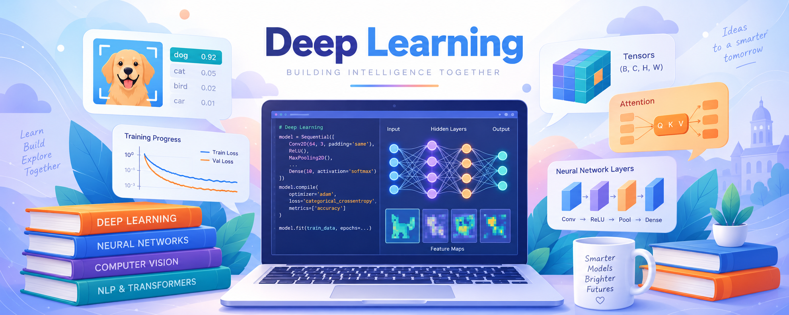

# CGUDL_2026_fall

  

# 深度學習 🧠
- 📅 學期：`2026 Fall`
- 🧑‍🏫 授課教師：林英嘉（長庚大學人工智慧學系）
- 🧾 科目代碼：`A3475 (AI系)` & `A33X9 (資工系)`
- 💻 使用語言：Python (PyTorch / Hugging Face Transformers)
- 🗣️ 授課語言：中文（含部分英文教材）
- [`課程影片 YouTube 播放清單`]()

| Week | Theme | Slide | Code | Slido | Video |
|:---:|---|:---:|:---:|:---:|:---:|
| 1 | 深度學習介紹以及本課程綱要 | | | | |
| 2 | 神經網路與梯度下降（含基礎線性代數與微積分） | | | | |
| 3 | 反向傳播法 | | | | |
| 4 | 最佳化方法：SGD, Momentum, RMSProp, Adam | | | | |
| 5 | 常見損失函數介紹（含基礎資訊理論與機率統計） | | | | |
| 6 | 卷積神經網路 | | | | |
| 7 | 過擬合、正規化、模型訓練技巧、期末專案介紹 | | | | |
| 8 | 自然語言處理：RNN 與序列建模 | | | | |
| 9 | 期中考 | | | | |
| 10 | 自注意力機制模型 | | | | |
| 11 | Vision Transformers (ViT)、自監督式學習與預訓練模型 | | | | |
| 12 | 大型語言模型 | | | | |
| 13 | 大模型時代如何有效率訓練模型？ | | | | |
| 14 | 圖神經網路 | | | | |
| 15 | 小組實作成果報告 (1) | | | | |
| 16 | 小組實作成果報告 (2) | | | | |
